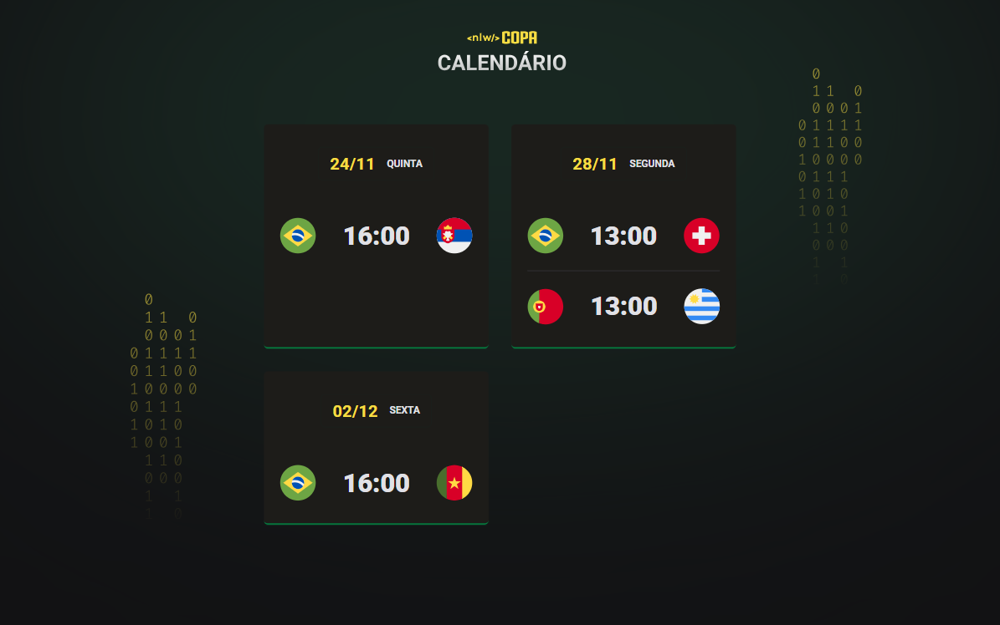

# 🏆 NLW Copa

Projeto desenvolvido durante a **Next Level Week - Copa** da Rocketseat. A proposta é criar um calendário interativo para acompanhar os jogos da Copa do Mundo, utilizando tecnologias web modernas.

## 📸 Preview

  

## 🚀 Tecnologias Utilizadas

- **HTML** – estrutura da página
- **CSS** – estilização do calendário
- **JavaScript** – dinamismo e interatividade

## ✨ Funcionalidades

- Exibição de jogos por data
- Estilização temática da Copa
- Geração dinâmica de conteúdo com JavaScript

## 📅 Histórico de Commits

- Estilização com CSS do calendário
- Adição de dinamismo com JavaScript
- Organização dos arquivos e pastas

## 📌 Como Executar

1. Clone o repositório:
   ```bash
   git clone https://github.com/mariana-nogueira21/nlw-copa.git


